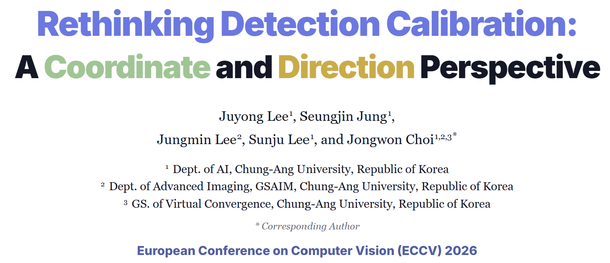

# Rethinking Detection Calibration: A Coordinate and Direction Perspective

Official PyTorch implementation of **“Rethinking Detection Calibration: A Coordinate and Direction Perspective”**, accepted to **ECCV 2026**.

<p align="left">
  <a href="https://jylee-vilab.github.io/"></a>
</p>

<p align="center">
  
</p>

## Authors

[Juyong Lee](https://sites.google.com/vilab.cau.ac.kr/jylee)<sup>1</sup>,
[Seungjin Jung](https://sites.google.com/vilab.cau.ac.kr/sjjung)<sup>1</sup>,
[Jungmin Lee](https://sites.google.com/vilab.cau.ac.kr/jungminleeshomepage/home?authuser=0)<sup>2</sup>,
[Sunju Lee](https://sites.google.com/vilab.cau.ac.kr/lsjoo/%ED%99%88)<sup>1</sup>,
and [Jongwoo Choi](https://www.vilab.cau.ac.kr/home)<sup>1,2,3,*</sup>

<sup>1</sup> Dept. of AI, Chung-Ang University, Republic of Korea  
<sup>2</sup> Dept. of Advanced Imaging, GSAIM, Chung-Ang University, Republic of Korea  
<sup>3</sup> GS. of Virtual Convergence, Chung-Ang University, Republic of Korea  

<sup>*</sup> Corresponding Author

---

## Contents

- [Introduction](#introduction)
- [Installation](#installation)
- [Dataset Preparation](#dataset-preparation)
- [Training and Evaluation](#training-and-evaluation)
- [References](#references)
- [Citation](#citation)

---

## Introduction

Reliable confidence estimates are essential for deploying object detectors in safety-critical applications. However, existing calibration methods mainly evaluate and calibrate confidence at the bounding-box level, which makes it difficult to identify how individual bounding-box coordinates contribute to localization uncertainty.

We propose **ReDC**, a detector-agnostic post-hoc calibration framework that provides coordinate-wise calibrated confidence scores while incorporating the direction of bounding-box misalignment. ReDC consists of coordinate-wise uncertainty calibration, misalignment direction estimation, and box-level confidence estimation based on the calibrated coordinate information.

The proposed framework does not require detector retraining and can be applied to different object detectors and calibration methods.

---

## Installation

Clone this repository:

```bash
git clone https://github.com/JyLee-vilab/ReDC.git
```

Create and activate the environment:

```bash
conda create -n redc python=3.10
```

Install the required packages:

```bash
pip install -r requirements.txt
```

---

## Dataset Preparation

ReDC requires ground-truth annotations and detector predictions for separate validation and test sets. The validation set is used to train the post-hoc calibration models, while the test set is used only for evaluation.

Organize the files as follows:

```text
data/
├── val_gt.json
├── val_pred.pkl
├── test_gt.json
└── test_pred.pkl
```

Also, each detector prediction should include:

```python
{
    image_id: {                        # int
        "file_name": str,
        "bboxes": np.ndarray,          # (N, 4), [x1, y1, x2, y2]
        "scores": np.ndarray,          # (N,)
        "labels": np.ndarray,          # (N,)
        "logits": np.ndarray,          # (N, C)
        "all_scores": np.ndarray,      # (N, C)
        "all_logits": np.ndarray,      # (N, C)
        "bbox_feature": list           # (N, D)
    }
}
```

Each prediction file should be a dictionary indexed by image ID. For each
image, the prediction entry should contain bounding boxes, confidence scores,
class labels, classification logits, class-wise scores, class-wise logits,
and detector-specific bounding-box features.

---

## Training and Evaluation

ReDC supports Platt Scaling [1] and Isotonic Regression [2] for box-level confidence calibration. The calibration method can be selected using the `box_calibration_type` argument.

```python
from ReDC import ReDC

# Initialize ReDC with the validation and test ground-truth annotations
redc = ReDC(val_gt_path, test_gt_path, max_dets=100,bin_count=25, is_coordinate_wise=True)

# Fit ReDC to the validation predictions
loc_calibrator, signmodel, iou_model,iou_thr,thresholds, sign_norm_stats = redc.fit(val_pred_path, \
    box_calibration_type='platt_scaling')

# Transform the test predictions using the trained calibration models
cal_test_detections = redc.transform(test_pred_path, \
    loc_calibrator,signmodel, iou_model,iou_thr, thresholds, sign_norm_stats)

# Evaluate the calibration performance
info = redc.evaluate_calibration(cal_test_detections, show_laece_plot=True, verbose = True)
```

The repository supports the following metrics:

### Detection Accuracy

* Average Precision (AP)
* Localization Recall Precision (LRP) Error [3]

### Box-Level Calibration

* Detection Expected Calibration Error (D-ECE) [4]
* Localization-aware Expected Calibration Error (LaECE) [5]
* Localization-aware Expected Calibration Error with zero IoU threshold (LaECE<sub>0</sub>) [6]

### Coordinate-Level Calibration

* Coordinate-wise Expected Calibration Error (C-ECE)
* Direction-aware Calibration Error (Da-CE)

---

## References

[1] J. Platt,  
“Probabilistic Outputs for Support Vector Machines and Comparisons to Regularized Likelihood Methods,” Advances in Large Margin Classifiers, 1999.

[2] B. Zadrozny and C. Elkan,  
“Transforming Classifier Scores into Accurate Multiclass Probability Estimates,” SIGKDD, 2002.

[3] K. Oksuz, B. Cam, E. Akbas, and S. Kalkan,  
“Localization Recall Precision (LRP): A New Performance Metric for Object Detection,” ECCV, 2018.

[4] F. Küppers, J. Kronenberger, A. Shantia, and A. Haselhoff,  
“Multivariate Confidence Calibration for Object Detection,” CVPR Workshops, 2020.

[5] K. Oksuz, T. Joy, and P. K. Dokania,  
“Towards Building Self-Aware Object Detectors via Reliable Uncertainty Quantification and Calibration,” CVPR, 2023.

[6] S. Kuzucu, K. Oksuz, J. Sadeghi, and P. K. Dokania,  
“On Calibration of Object Detectors: Pitfalls, Evaluation and Baselines,” ECCV, 2024.

---
